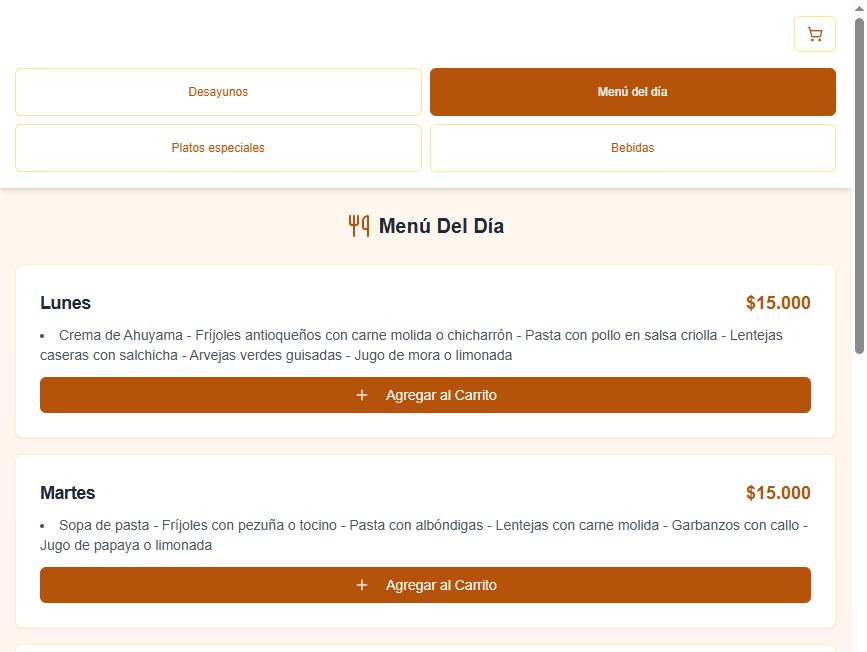
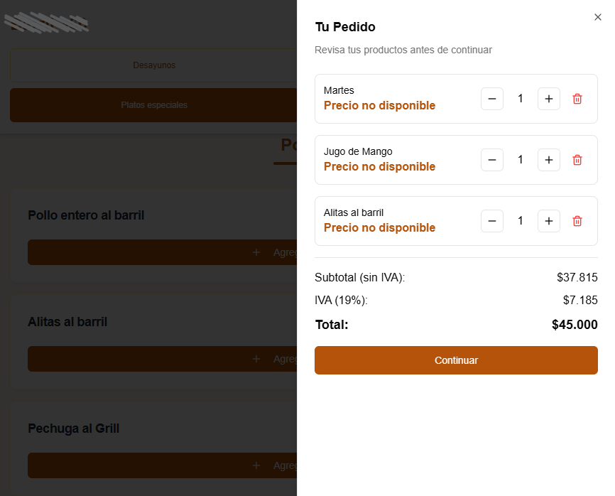

# Restaurant Management Web Application

Aplicación web para la administración de un restaurante, con funcionalidades para gestionar pedidos, controlar visibilidad del menú, manejar “Menú del Día”, administrar platos, revisar ventas y gestionar todo desde un panel administrativo protegido por PIN.  
El proyecto integra un **frontend desarrollado en Next.js** y un **backend implementado en Flask**, comunicándose mediante rutas API.

---

## 🧩 Tecnologías Utilizadas

### **Frontend**
- Next.js / React  
- TypeScript  
- TailwindCSS  
- shadcn/ui  
- lucide-react  

### **Backend**
- Flask  
- Flask-CORS  
- Blueprints:
  - `pedidos_routes` → manejo de pedidos  
  - `admin_routes` → gestión de platos, visibilidad y ventas  
- Compatibilidad con PyInstaller  
- En modo desarrollo, proxy automático hacia Next.js  


---

## 📁 Estructura del Proyecto

    /backend
    ├── app.py
    ├── admin_routes.py
    ├── cargar_platos.py
    ├── init_db.py
    ├── models.py
    ├── pedidos_routes.py
    ├── print_utils
    ├── update_db.py
    ├── static/ # Archivos generados por el build de Next.js
    ├── build/ #Exe para impresion de ordenes

    /frontend
    ├── app/
    ├──── global.css
    ├──── layout.tsx
    ├──── page.tsx
    ├── components/
    ├── public/
    ├── styles/

    database.db # Base de datos usada por Flask


---
## 📸 Capturas

A continuación se presentan dos imágenes representativas de la interfaz:

### Menú del Día
<p align="center">
  
</p>

### Carrito de Compras
<p align="center">
  
</p>

---

## 🍽️ Funcionalidades Principales

### **Interfaz para Clientes (Frontend)**
- Vista del menú por categorías:
  - Desayunos  
  - Menú del Día  
  - Platos Especiales (con subcategorías)  
  - Bebidas (con subcategorías)  
- Carrito dinámico con:
  - Incremento/disminución de cantidades  
  - Eliminación de productos  
- Flujo de compra:
  - Selección del tipo de pedido (mesa o domicilio)
  - Datos del cliente
  - Resumen y confirmación  
- Cálculo automático:
  - Subtotal  
  - IVA (19%)  
  - Total  
  - Costo de domicilio  
- Envío del pedido al backend (`/api/pedidos`)  
- Interfaz limpia y responsive usando Tailwind + shadcn/ui  

---

### **Panel de Administración (con PIN)**
Al acceder al panel, se solicita PIN (4328) para proteger todo el entorno administrativo.

Incluye:

#### ✔️ Gestión del menú  
- Mostrar / ocultar cada plato individualmente  
- Control de subcategorías  
- Restricción automática: **solo un menú del día puede estar visible**  
- Edición completa de los Menús del Día  
- Eliminación de platos  
- Añadir nuevos platos desde el panel  

#### ✔️ Ventas del día  
- Resumen total  
- Platos vendidos organizados por categoría  
- Cantidades vendidas por plato  

#### ✔️ Utilidades  
- Scripts para inicializar y actualizar BD  
- Sistema de impresión mediante ejecutable (`/backend/build/`)  

---

### **Backend Flask**
- Sirve el frontend (Next.js) desde `static/` en producción  
- En desarrollo:
  - Intenta conectarse a `http://localhost:3000` vía proxy  
- Reescribe dinámicamente contenido HTML/CSS/JS cuando es necesario  
- Ofrece APIs REST:

#### **Rutas de Pedidos**
- `POST /api/pedidos` → crear pedido

#### **Rutas de Administración**
- `GET /api/admin/platos` → obtener todos los platos  
- `POST /api/admin/platos` → crear un plato  
- `PUT /api/admin/platos/<id>` → editar un plato  
- `DELETE /api/admin/platos/<id>` → eliminar un plato  
- `PATCH /api/admin/platos/<id>/visibilidad` → mostrar/ocultar plato  
- `GET /api/admin/ventas/hoy` → reportes de ventas del día  

---

## ▶️ Ejecución del Proyecto

### **1. Backend**
```bash
cd backend
pip install -r requirements.txt
python init_db.py
python cargar_platos.py
python app.py
```
### Servidor Flask:

http://localhost:8000

###2. Frontend

    cd frontend
    npm install
    npm run dev


### Servidor Next.js:

http://localhost:3000

> [!NOTE]
> Durante desarrollo Flask hace proxy si los archivos no existen en static/.

# My Project

This is a brief description of my project.


## 🚀 Build para Producción

### Generar el build del frontend:

    cd frontend
    npm run build


### Copiar el contenido generado dentro de:

    /backend/static/


### Ejecutar Flask:

    python app.py

> [!NOTE]
> Flask servirá toda la aplicación desde los archivos estáticos.

🤝 Autores

Proyecto desarrollado en colaboración:

[Nicolas Avila](https://github.com/Nico-gear15) -> frontend (Next.js + TypeScript + Tailwind).

[Daniel Torres](https://github.com/DeathbatO13) -> backend (Flask + administración + API + lógica de pedidos + impresión).
